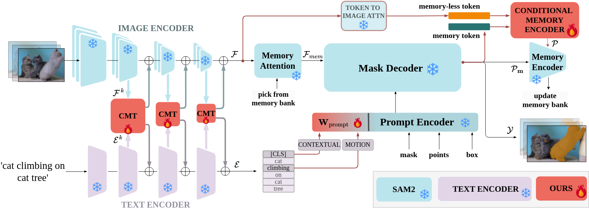

# SAMWISE: Infusing wisdom in SAM2 for Text-Driven Video Segmentation

[Claudia Cuttano](), [Gabriele Trivigno](), [Gabriele Rosi](), [Carlo Masone](), [Giuseppe Averta]()

Official repository for the paper: "SAMWISE: Infusing wisdom in SAM2 for Text-Driven Video Segmentation". In this work we build upon the Segment-Anything 2 (SAM2) model and make it wiser, by empowering it with natural language understanding and explicit temporal modeling  at the feature extraction stage, without fine-tuning its weights, and without outsourcing modality interaction to external models. Our proposed method, SAMWISE, achieves state-of-the-art across various benchmarks, by adding a negligible overhead of just 4.2 M parameters.

**[📄[arXiv]](https://arxiv.org/abs/2411.17646)**

🚀 **Code and Trained Models Coming Soon!** 🚀

  
     <em>Our proposed SAMWISE.</em>

### SAMWISE in Action 👀
Our approach integrates natural language knowledge and temporal cues for <b>streaming-based Referring Video Segmentation (RVOS)</b>. We mitigate tracking bias—where the model may overlook an identifiable object while tracking another—through a learnable mechanism. This enables efficient streaming processing, leveraging memory from previous frames to maintain context and ensure accurate object segmentation.

  
     <em> SAMWISE for streaming-based RVOS.</em>

SAMWISE (our model, not the hobbit) segments objects from The Lord of the Rings in zero-shot—no extra training, just living up to its namesake! 🧙‍♂️✨

