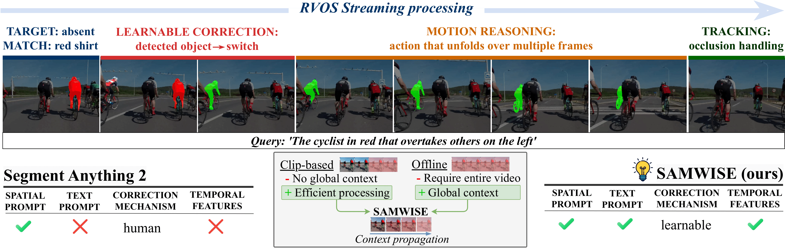

<div align="center">


# SAMWISE: Infusing Wisdom in SAM2 for Text-Driven Video Segmentation [CVPR 2025]

🎉 **CVPR 2025 Accepted Paper!** 🎉  

[Claudia Cuttano](), [Gabriele Trivigno](), [Gabriele Rosi](), [Carlo Masone](), [Giuseppe Averta]()

</div>

Welcome to the official repository for **SAMWISE**, our CVPR 2025 paper: *"SAMWISE: Infusing Wisdom in SAM2 for Text-Driven Video Segmentation"*.  

In this work, we build upon **Segment Anything 2 (SAM2)** and make it **wiser** by infusing **natural language understanding** and **explicit temporal modeling**.  
🚀 **No fine-tuning of SAM2 weights.**  
🧠 **No reliance on external VLMs for multi-modal interaction.**  
📈 **State-of-the-art performance across multiple benchmarks.**  
💡 **Minimal overhead: just 4.9 M additional parameters!**  

📄 **[Read our paper on arXiv](https://arxiv.org/abs/2411.17646)**

## SAMWISE in Action 👀
<!-- 
Our approach integrates natural language knowledge and temporal cues for <b>streaming-based Referring Video Segmentation (RVOS)</b>. We mitigate tracking bias—where the model may overlook an identifiable object while tracking another—through a learnable mechanism. This enables efficient streaming processing, leveraging memory from previous frames to maintain context and ensure accurate object segmentation.

<p align="center">
  
    <br/><em> SAMWISE for streaming-based RVOS.</em>
</p>
-->

SAMWISE (our model, not the hobbit) segments objects from The Lord of the Rings in zero-shot—no extra training, just living up to its namesake! 🧙‍♂️✨


## 📊 Data Preparation  
Before running SAMWISE, set up your ```dataset```: refer to [data.md](docs/data.md) for detailed data preparation.  
Once organized, the directory structure should look like this:
```
SAMWISE/
├── data/
│   ├── ref-youtube-vos/
│   ├── ref-davis/
│   ├── MeViS/
├── datasets/
├── models/
│   ├── sam2/
│   ├── samwise.py
│   ├── ...
...
```

## ⚙️ Environment Setup  

The code has been tested with **Python 3.10** and **PyTorch 2.3.1 (with CUDA 11.8)**. To set up the environment using Conda, run:  

```bash
conda create --name samwise python=3.10 -y
conda activate samwise
pip install torch==2.3.1 torchvision==0.18.1 --index-url https://download.pytorch.org/whl/cu118
pip install -r requirements.txt
```

## 🎥 Referring Video Object Segmentation (RVOS)  

**Reproducing Our Results**: Below, we provide the ```model weights``` to replicate the results of our paper.

|       Dataset       | Total Parameters | Trainable Params |   J&F    |                                              Model                                               |                                             Zip                                              |
|:-------------------:|:----------------:|:----------------:|:--------:|:------------------------------------------------------------------------------------------------:|:--------------------------------------------------------------------------------------------:|
|      **MeViS**      |      210 M       |      4.9 M       | **49.5** |  [Weights](https://drive.google.com/file/d/1Molt2up2bP41ekeczXWQU-LWTskKJOV2/view?usp=sharing)   | [Zip](https://drive.google.com/file/d/10gnlVzFyPWa6pKk37eljKAR_7gJDcg72/view?usp=drive_link) |
| **MeViS - valid_u** |      210 M       |      4.9 M       | **57.1** |  [Weights](https://drive.google.com/file/d/1Molt2up2bP41ekeczXWQU-LWTskKJOV2/view?usp=sharing)   |                                              -                                               |
| **Ref-Youtube-VOS** |      210 M       |      4.9 M       | **69.2** | [Weights](https://drive.google.com/file/d/17Ei9XU678tCiiV14c-9EB9ZqXVrj4qEw/view?usp=drive_link) |                                           [Zip](https://drive.google.com/file/d/1bkO8lyR6Vyk6lHIcQqscvlDPYRiVMQJs/view?usp=drive_link)                                            |
|    **Ref-Davis**    |      210 M       |      4.9 M       | **70.6** |                                           [Weights](https://drive.google.com/file/d/17Ei9XU678tCiiV14c-9EB9ZqXVrj4qEw/view?usp=drive_link)                                            |                                              -                                               |


To evaluate the model on **MeViS - valid_u** run the following command:
```
python3 inference_mevis.py --split valid_u --resume=[/path/to/model_weight] --name_exp [name_exp] --HSA --use_cme_head
```

For **Ref-Davis** run the following command:
```
python3 inference_davis.py --resume=[/path/to/model_weight] --name_exp [name_exp]  --HSA --use_cme_head
```
For **MeViS and Ref-Youtube-VOS**, upload the **zip file** to:
- [Ref-Youtube-VOS Competition Server](https://codalab.lisn.upsaclay.fr/competitions/3282)
- [MeViS Competition Server](https://codalab.lisn.upsaclay.fr/competitions/21944)


## 🖼️ Referring Image Segmentation (RIS)
We also test SAMWISE on the **Referring
Image Segmentation (RIS)** benchmark.

| RefCOCO | RefCOCO+ | RefCOCOg |                   Model                    | 
|:-------:|:--------:|:--------:|:------------------------------------------:| 
|  75.6   |   65.8   |  66.8    | [Weights](https://drive.google.com/file/d/1gRGzARDjIisZ3PnCW77Y9TMM_SbV8aaa/view?usp=drive_link) |

Run the following to evaluate on RIS:
```
python3 main_pretrain.py --eval --resume=[/path/to/model_weight] --name_exp [name_exp] --disable_pred_obj_score 
```

## 🚀 Training and Inference  

For step-by-step instructions on training and inference, please refer to the [Training and Inference Guide](docs/training-and-inference.md).

This document includes all necessary details on:  
✅ Training SAMWISE on different datasets  
✅ Running inference and evaluating performance  
✅ Submitting results to online benchmarks  


## 🔗 Acknowledgements
We build upon the amazing work from:

- [Segment Anything 2](https://github.com/facebookresearch/sam2)
- [ReferFormer](https://github.com/wjn922/ReferFormer)
- [Fairseq](https://github.com/facebookresearch/fairseq)